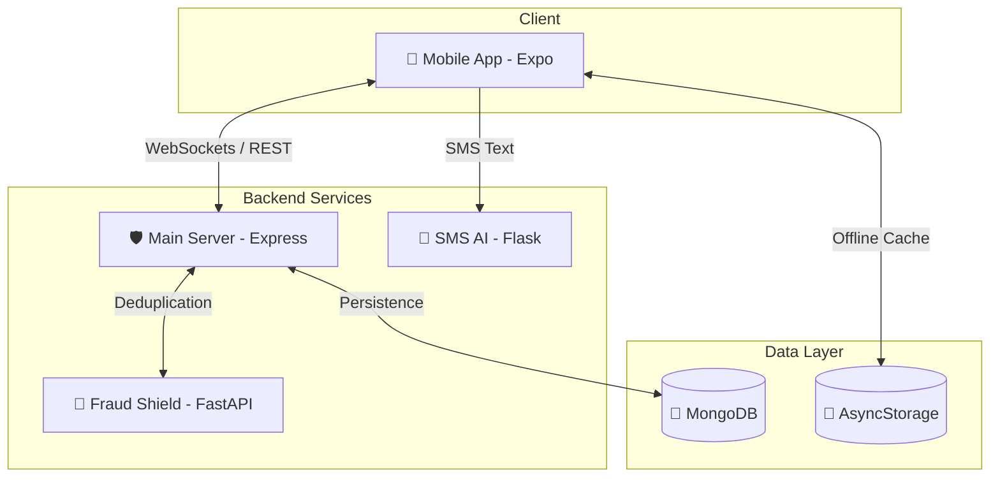

# 💰 MoneyMate 2.0 — All-in-One GenZ Fintech Ecosystem

> **The ultimate financial companion for the next generation.**  
> MoneyMate 2.0 combines real-time transaction tracking, AI-powered SMS intelligence, parental controls, and advanced fraud detection into a single, high-performance ecosystem.

---

## 🏗️ Ecosystem Architecture

The platform is built as a modular microservices architecture, ensuring scalability and performance across different financial tasks.



---

## 📂 Project Structure

| Component | Directory | Description |
|---|---|---|
| **Frontend** | `/frontend` | React Native (Expo) app with Glassmorphism UI & Logic. |
| **Backend** | `/server` | Node.js/Express orchestration layer with WebSockets. |
| **AI Insights** | `/ai-service` | Flask service for SMS classification & anomaly detection. |
| **Fraud Shield** | `/fraud-detect` | ML service for real-time transaction risk scoring (XGBoost). |

---

## 🚀 Quick Start Guide

### Prerequisites
- **Node.js**: v18+ 
- **Python**: v3.9+ 
- **MongoDB**: v6.0+ (Running locally or via Atlas)
- **Expo Go**: Installed on your mobile device (for testing)

### Installation Flow

1. **Clone the Repo**:
   ```bash
   git clone https://github.com/techowearauth-dot/moneymate.git
   cd moneymate
   ```

2. **Backend Setup**:
   ```bash
   cd server && npm install
   # Create .env with MONGODB_URI, JWT_SECRET
   npm run dev
   ```

3. **AI Services Setup**:
   ```bash
   # SMS Intelligence
   cd ai-service && pip install -r requirements.txt
   python app.py

   # Fraud Detection
   cd fraud-detect && pip install -r requirements.txt
   uvicorn backend:app --reload --port 8000
   ```

4. **Frontend Setup**:
   ```bash
   cd frontend && npm install
   npx expo start
   ```

---

## ✨ Key Features

- **🧠 Smart Ledger**: Automatically categorizes bank SMS (HDFC, SBI, ICICI, etc.) into a clean, searchable ledger.
- **📦 Message Cabinet**: Isolates OTPs, E-commerce, and Spam from financial data.
- **🔐 Privacy First**: OTPs auto-delete after 15 mins; Spam auto-clears after 1 hour.
- **🛡️ Fraud Shield**: Scans every transaction in real-time using XGBoost to detect spending anomalies.
- **👨‍👩‍👧 Parental Control**: Dedicated monitoring suite for child activity with spend limits and sync.
- **💎 Obsidian UI**: A premium "VisionOS" inspired high-contrast theme for elite user experience.

---

## ⚙️ Environment Configuration

Each service requires specific environment variables to function correctly. Ensure you create `.env` files in the following locations:

### `/server/.env`
```env
PORT=5000
MONGODB_URI=mongodb://localhost:27017/moneymate
JWT_SECRET=your_jwt_secret
RAZORPAY_KEY_ID=xxx
RAZORPAY_KEY_SECRET=xxx
```

### `/frontend/.env` (optional)
```env
EXPO_PUBLIC_API_URL=http://your-local-ip:5000
EXPO_PUBLIC_AI_URL=http://your-local-ip:5050
```

---

## 🛠️ Tech Stack

- **Frontend**: React Native, Expo, Reanimated 3, Linear Gradient, BlurView.
- **Backend**: Node.js, Express, Socket.io, Mongoose (MongoDB).
- **AI/ML**: Python (FastAPI/Flask), XGBoost, Scikit-learn, TF-IDF.
- **Payments**: Razorpay Integration for manual fund handling.

---

## 📋 Troubleshooting

- **Android Emulator**: Use `10.0.2.2` as the localhost alias to connect to the Node.js server.
- **SMS Not Scanning**: Ensure the app has SMS permissions and the `ai-service` is running on port 5050.
- **Fraud Alerts Busy**: Check if `fraud-detect` (FastAPI) is running on port 8000.

---

*MoneyMate 2.0 — Empowering Gen Z with Financial Intelligence.*  
Developed by the MoneyMate Team.
