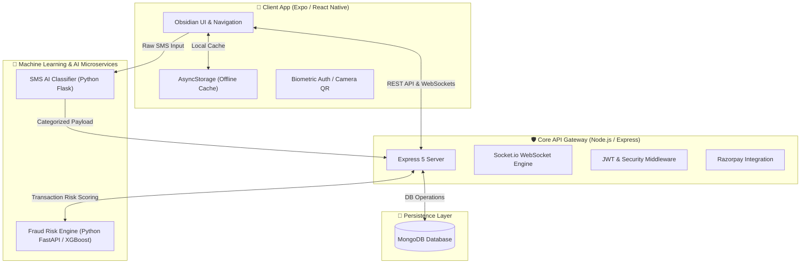

# 💰 MoneyMate 2.0 — Next-Gen AI Fintech & Wealth Ecosystem

[](https://reactnative.dev/)
[](https://expo.dev/)
[](https://nodejs.org/)
[](https://expressjs.com/)
[](https://www.mongodb.com/)
[](https://www.python.org/)
[](https://fastapi.tiangolo.com/)
[](LICENSE)

> **MoneyMate 2.0** is an all-in-one, privacy-focused financial companion tailored for Gen Z and modern users. It seamlessly combines **real-time transaction parsing**, **AI-driven SMS intelligence**, **XGBoost machine learning fraud detection**, **parental spend monitoring**, **stock market tracking**, and an **Obsidian Glassmorphism design system**.

---

## 🌟 Key Highlights & Features

### 🧠 Smart SMS Parser & Ledger
- **Automatic Bank Parsing**: Extracts transaction amounts, merchants, balances, and transaction types from bank SMS notifications (HDFC, SBI, ICICI, Axis, Paytm, etc.).
- **Message Cabinet**: Categorizes incoming financial SMS messages into cleanly separated buckets (Debits, Credits, OTPs, E-Commerce, and Spam).
- **Auto-Cleanup Vault**: Automatically purges sensitive OTPs after 15 minutes and clears spam after 1 hour for enhanced privacy.

### 🛡️ AI Fraud Shield & Anomaly Detection
- **XGBoost Machine Learning Model**: Analyzes transaction patterns in real-time to compute risk scores (0–100%).
- **Fraud Risk Flags**: Instantly alerts users to suspicious activity, foreign merchant anomalies, or unusual debit spikes.
- **WebSocket Live Alerts**: Pushes instant security warnings directly to the mobile application via Socket.io.

### 👨‍👩‍👧 Parental Control & Family Sync
- **Child Account Linking**: Parents can monitor connected child profiles in real-time.
- **Spend Guard**: Set daily/monthly spend limits and category restrictions.
- **Instant Approval**: Trigger approval requests for high-value transactions.

### 💳 Payments & Stock Market Suite
- **Razorpay Payment Gateway**: Seamless integration for adding funds, bill payments, and merchant checkouts.
- **QR Code Scanner**: Integrated camera scanner for instant UPI & digital payments.
- **Stock Market Hub**: Real-time market updates, watchlist tracking, and visual portfolio analytics.

### 💎 Obsidian Glassmorphism UI (VisionOS Inspired)
- **Fluid Micro-Animations**: Built with `react-native-reanimated` and `expo-haptics` for tactile user interactions.
- **High-Contrast Dark Theme**: Deep black surfaces paired with vibrant frosted glass blur effects (`expo-blur`).
- **Biometric Security**: Quick authentication with fingerprint/FaceID via `expo-local-authentication`.

---

## 🏗️ Architecture Overview

MoneyMate 2.0 adopts a decoupled, high-performance microservices architecture with real-time WebSocket communication and dedicated AI processing layers:



---

## 📂 Project Directory Structure

```text
MONEYMATE2.0/
├── 📁 frontend/            # React Native (Expo) Mobile Application
│   ├── 📁 src/
│   │   ├── 📁 components/ # Reusable UI Components (Glassmorphism Cards, Buttons)
│   │   ├── 📁 navigation/ # Stack, Tab, and Drawer Navigators
│   │   ├── 📁 screens/    # 20+ App Screens (Home, Activity, Fraud, Stocks, etc.)
│   │   ├── 📁 services/   # API Clients, Socket.io listeners, Storage Utils
│   │   └── 📁 context/    # Global State Management (Auth, Theme, Transactions)
│   └── package.json
├── 📁 server/              # Node.js / Express 5 API Service
│   ├── 📁 controllers/    # Authentication, Security, Payment Logic
│   ├── 📁 routes/         # Express API Endpoints
│   ├── 📁 models/         # MongoDB Schemas (User, Transaction, Settings)
│   ├── 📁 middlewares/    # JWT Authentication & Rate Limiters
│   └── server.js          # App Entrypoint & Socket.io initialization
├── 📁 ai-service/          # Python Flask Natural Language Processing Microservice
│   ├── app.py             # Flask API Server (Port 5050)
│   ├── sms_model.pkl      # Trained SMS Classification Model
│   └── tfidf_vectorizer.pkl # TF-IDF Feature Extractor
├── 📁 fraud-detect/        # Python FastAPI XGBoost Machine Learning Service
│   ├── 📁 files/
│   │   ├── backend.py     # FastAPI Server & Risk Engine (Port 8000)
│   │   └── main.py        # Model Training & Dataset Pipeline
│   └── fraud_dataset.xlsx # Training Dataset
└── 📁 docs/                # Project Assets & Screenshots
    └── 📁 images/         # Hero banner & preview graphics
```

---

## 🛠️ Technology Stack

| Domain | Technology / Library | Purpose |
|---|---|---|
| **Mobile Frontend** | React Native, Expo 54, React 19 | Cross-platform iOS & Android App |
| **Styling & UI** | Expo Blur, Linear Gradient, Reanimated 4, Haptics | VisionOS Glassmorphism Theme |
| **Core Backend** | Node.js v18+, Express 5, Socket.io | Core orchestration, auth & real-time events |
| **Database** | MongoDB, Mongoose 9 | User profile & transaction storage |
| **SMS AI Engine** | Python, Flask, Scikit-learn, TF-IDF | Natural language SMS classification |
| **Fraud Detector** | Python, FastAPI, XGBoost, Pandas | Real-time risk scoring and anomaly detection |
| **Payments & Security** | Razorpay SDK, JWT, Bcrypt, Helmet | Payments processing and security layer |

---

## ⚡ Quick Start Guide

### Prerequisites
Make sure you have the following installed on your machine:
- **Node.js** (v18.0 or higher)
- **Python** (v3.9 or higher)
- **MongoDB** (Running locally on port 27017 or a MongoDB Atlas connection string)
- **Expo Go** app on your iOS/Android device (or Android Studio / Xcode emulator)

---

### Step-by-Step Installation

#### 1. Clone the Repository
```bash
git clone https://github.com/techowearauth-dot/moneymate.git
cd MONEYMATE2.0
```

#### 2. Start Main Node.js Backend Server
```bash
cd server
npm install
# Configure your .env file (see Environment Setup below)
npm run dev
```
> Server runs on `http://localhost:5000`

#### 3. Start SMS AI Classifier Service
```bash
cd ../ai-service
pip install flask scikit-learn joblib numpy
python app.py
```
> AI Service runs on `http://localhost:5050`

#### 4. Start Fraud Detection ML Service
```bash
cd ../fraud-detect/files
pip install fastapi uvicorn xgboost pandas scikit-learn openpyxl
uvicorn backend:app --reload --port 8000
```
> Fraud Service runs on `http://localhost:8000`

#### 5. Launch Mobile Frontend (Expo)
```bash
cd ../../frontend
npm install
npx expo start
```
> Scan the QR code using the **Expo Go** app on Android/iOS, or press `a` for Android Emulator / `i` for iOS Simulator.

---

## ⚙️ Environment Variables Configuration

Create `.env` files in the respective service directories before launching:

### Server Environment (`server/.env`)
```env
PORT=5000
MONGODB_URI=mongodb://localhost:27017/moneymate
JWT_SECRET=your_super_secret_jwt_key_here
RAZORPAY_KEY_ID=your_razorpay_key_id
RAZORPAY_KEY_SECRET=your_razorpay_key_secret
NODE_ENV=development
```

### Frontend Environment (`frontend/.env` - Optional)
```env
EXPO_PUBLIC_API_URL=http://<YOUR_LOCAL_IP>:5000
EXPO_PUBLIC_AI_URL=http://<YOUR_LOCAL_IP>:5050
EXPO_PUBLIC_FRAUD_URL=http://<YOUR_LOCAL_IP>:8000
```
*(Note: Replace `<YOUR_LOCAL_IP>` with your computer's local IP address e.g. `192.168.1.10` when testing on a physical phone via Expo Go).*

---

## 🔒 Security & Privacy Practices

1. **Local SMS Processing**: SMS parsing can execute locally or via isolated microservices without storing unneeded personal text message history.
2. **Auto-Purge Vault**: Sensitive OTP notifications are automatically discarded after 15 minutes.
3. **Encrypted Credentials**: Passwords are hashed using `bcryptjs` with salt rounds, and API routes are secured via **JWT tokens** and **Helmet.js** security headers.
4. **Rate Limiting**: Protected against brute force using `express-rate-limit`.

---

## 📱 Mobile App Screenshots & Navigation

| Screen | Description |
|---|---|
| **Dashboard** | Overview of balance, expense graph, quick transactions, and stock highlights. |
| **Activity** | Detailed categorical spending breakdowns and interactive visual charts. |
| **Fraud Shield** | Live risk scoring log, flag alerts, and security rule configurations. |
| **Parental Control** | Child spending limits, lock controls, and parent-child sync panel. |
| **Message Cabinet** | Categorized SMS inbox (Debits, Credits, OTPs, E-Commerce, Spam). |

---

## 🤝 Contributing

Contributions are welcome! If you'd like to improve MoneyMate 2.0:
1. Fork the Project Repository.
2. Create your Feature Branch (`git checkout -b feature/AmazingFeature`).
3. Commit your Changes (`git commit -m 'Add some AmazingFeature'`).
4. Push to the Branch (`git push origin feature/AmazingFeature`).
5. Open a Pull Request.

---

## 📄 License

Distributed under the **MIT License**. See `LICENSE` for more information.

---

<div align="center">
  <sub>Built with ❤️ by the <b>MoneyMate Engineering Team</b>. Empowering Gen Z with Next-Gen Financial Intelligence.</sub>
</div>
